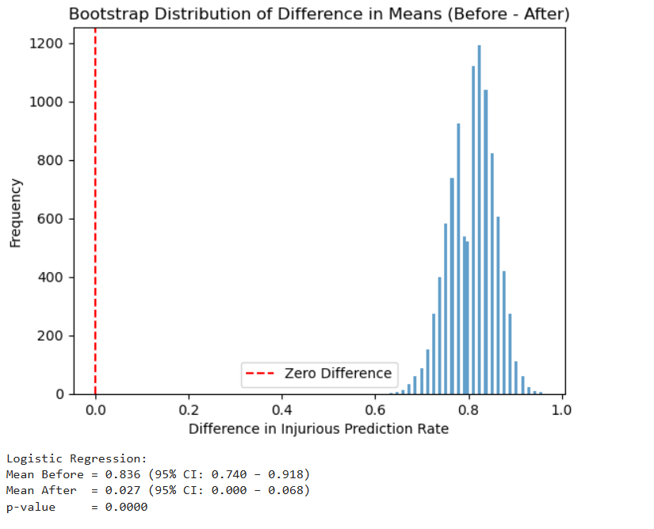
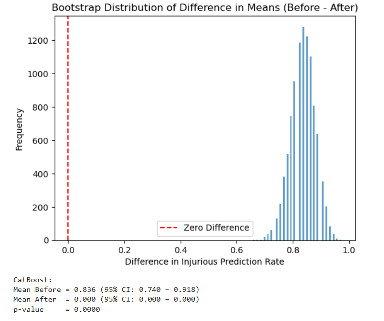

#                                                                             
 Tuning Up Music Highway

This is a repository for the Tuning Up Music Highway project as part of The Erdős Institute Summer 2025 Data Science Bootcamp.

Team members: Ruixuan Ding, [John Hurtado](https://github.com/hurtadocadavid21), [Yang Mo](https://github.com/zetacaveman), [James O'Quinn](https://github.com/JamesOQ), [Chilambwe Wapamenshi](https://github.com/ChilambweWapamenshi)

Acknowledgements: We would first like to thank everyone at the Erdős Institute for providing the structure, resources, and education that made this project possible. Additionally, we are thankful for the detailed data and dashboards made publicly available by the Tennessee Department of Safety and Homeland Security. Also, special thanks to Steven Gubkin for their helpful comments and feedback. Finally, we are especially grateful to have had Greg Taylor as our project mentor, and for his generous guidance, encouragement, and advice throughout the project.

#  Table of Contents

1. [Introduction](#introduction)  
2. [Dataset Generation](#dataset-generation)  
3. [Exploratory Data Analysis](#exploratory-data-analysis)  
4. [Modeling & Hypothesis Testing](#modeling--hypothesis-testing)  
5. [Results](#results)  
6. [Conclusion](#conclusion)  
7. [Future Work](#future-work)  
8. [Description of Repository](#description-of-repository)  

##  
 Introduction

&nbsp;&nbsp;&nbsp;&nbsp; Often regarded by residents, and even [some](https://www.dangerousroads.org/north-america/usa/10683-i-40-the-most-dangerous-road-in-nashville-for-auto-accidents.html) [observers](https://www.gkbm.com/blog/interstate-40-car-accidents-tennessee/), as the most dangerous highway in Tennessee, the stretch of Interstate 40 between Memphis and Nashville, known as Music Highway, could use a serious tuning up. This project aims to evaluate the efficacy and cost-effectiveness of various safety interventions on selected segments of Music Highway in Madison and Henderson counties using data modeling and hypothesis testing. To this end, we first obtained a recent crash dataset from the Tennessee Department of Safety and Homeland Security, which includes crash severity and GPS location. After filtering the dataset to include only crashes occurring on the relevant section of I-40, we manually annotated each crash with geospatial features (e.g., presence of guardrails, type of median, pavement condition) using Google Maps. We then conducted exploratory data analysis to identify promising strategies and target segments, performed model-based hypothesis testing to assess the impact of safety features on crash severity, and developed a cost-benefit analysis for the most effective interventions.

## 
 Dataset Generation

&nbsp;&nbsp;&nbsp;&nbsp; Since physical safety strategies are the type of strategy most feasible for our modeling approach, we set out to create a dataset which would allow us to understand how severity of a crash (in terms of human harm) would be influenced by the various geographic and physical features of the highway near the crash. Our first step was to collect recent (2023-2025) crash data from the dashboards publicly provided by the Tennessee Department of Safety and Homeland Security:
1. [Recent Crashes Dashboard](https://www.tn.gov/safety/stats/dashboards/recent-crashes.html)
2. [Serious Injuries and Fatalities Dashboard](https://www.tn.gov/safety/stats/dashboards/fatalseriousinjurycrashes.html)

This involved highlighting the crash data we wanted to collect on the dashboards with a selection box and saving the data as a .csv file. Because the "Recent Crashes" webpage would itself crash when too many data points were selected, and because the stretch of I-40 through Madison and Henderson counties showed an unusually high number of crashes involving severe injuries and fatalities, despite being mostly rural, we chose to focus our analysis on crashes that occurred specifically within these two counties. While it was infeasible to collect only the crashes from the "Recent Crashes" dashboard that happened on I-40, we were able to get all recent crashes in Madison and Henderson counties and resolved to filter for I-40 crashes later. Here, are the two datasets immediately after we collected them from the above dashboards:
1. [Recent Crashes in Madison and Henderson Counties Dataset](https://github.com/JamesOQ/Tuning-Up-Music-Highway/blob/main/datasets/Overall%20geospatial%20crash%20data%20for%20Madison%20and%20Henderson%20counties.csv),
2. [Serious Injuries and Fatalities I-40 Dataset](https://github.com/JamesOQ/Tuning-Up-Music-Highway/blob/main/datasets/Serious%20Injuries%20and%20Fatalities%20Data%20for%20I-40%20Tennessee.csv).

Note that the first dataset only includes three features: latitude, longitude, and crash type. While we did reach out to the responsible Tennessee state department to see if we could get a "Recent Crashes" dataset as detailed as the "Serious Injuries and Fatalities" dataset and received a reply, we never received that more detailed dataset.

&nbsp;&nbsp;&nbsp;&nbsp; Next, since the exact time and date of most crashes in the "Serious Injuries and Fatalities" dataset were recorded, but not the weather condition and road surface wetness at the time of each crash, we set out to create a data pipeline which would query a historical weather API to automatically add weather information to each crash datapoint. We did this by creating a Python notebook which queries the [Visual Crossing](https://www.visualcrossing.com/) weather API to update our dataset with the corresponding weather condition at each crash. That notebook can be found [here](https://github.com/JamesOQ/Tuning-Up-Music-Highway/blob/main/Code/Weather%20data%20API%20query.ipynb). We also added a graded road surface wetness feature by finding the cumulative rainfall total six hours before the time each crash occurred using the grading:
- more than 5 inches of cumulative rainfall is labeled as 'soaking',
- between 1 inch and 5 inches of cumulative rainfall is labeled as 'very wet',
- between 0 and 1 inches of cumulative rainfall is 'damp',
- otherwise 'dry'.

The notebook for that can be found [here](https://github.com/JamesOQ/Tuning-Up-Music-Highway/blob/main/Code/Road%20Wetness%20API%20query.ipynb). While the weather and road surface wetness features were helpful during exploratory data analysis, we did not use these features in our final analysis.

&nbsp;&nbsp;&nbsp;&nbsp; The key aspect of our feature engineering was the tagging of geospatial features manually recorded from Google Maps. Since all images on Google Maps of our segment on I-40 are consistent with the timeframe of crashes in our datasets (2023-2025), and no major construction projects occurred on this segment during that timeframe, we expect the geospatial features on Google Maps to be mostly consistent with the geospatial features at the time of each crash. We determined it would be best to manually record features through Google Streetview to maintain accuracy. The following table shows the features and categories that we recorded:
| Feature                                | 0                        | 1                        | 2                        | 3                        | 4                               |
|----------------------------------------|--------------------------|--------------------------|--------------------------|--------------------------|----------------------------------|
| **Presence of guardrails**             | None                     | One side only            | Both sides               | Partial or damaged       | –                                |
| **Cable barriers**                     | None                     | Median only              | Shoulder only            | Both median and shoulder | –                                |
| **Rumble strips**                      | None                     | Centerline only          | Shoulder only            | Both centerline & shoulder | –                              |
| **Pavement condition**                 | Unknown                  | Poor (cracks, potholes)  | Fair                     | Good                     | Excellent (recently resurfaced)  |
| **Proximity to entrances/exits**       | Not near entrance/exit   | Near entrance/exit (≤400m) | –                     | –                        | –                                |
| **Urban vs. rural**                    | Rural                    | Suburban                 | Urban                    | –                        | –                                |
| **Natural features**                   | Open/plain               | Forested/wooded          | Near water body          | Hilly/rocky              | Mixed/complex terrain            |
| **Number of lanes**                    | One lane                 | Two lanes                | 3–4 lanes                | 5+ lanes                 | –                                |
| **Shoulder type/width**                | No shoulder              | Narrow, unpaved          | Narrow, paved            | Wide, unpaved            | Wide, paved                      |
| **Posted speed limit**                | ≤35 mph                  | 40–55 mph                | 60–65 mph                | 70+ mph                  | –                                |
| **Median/divider type**                | None                     | Painted median           | Grass median             | Raised concrete divider  | Guardrail or cable divider       |
| **Lane marking/signage visibility**    | Missing/faded            | Poor                     | Average                  | Clear/visible            | Fresh/high-reflectivity          |
| **Nighttime lighting/visibility**      | No lighting              | Poor                     | Moderate                 | Well-lit                 | –                                |

We recorded the feature categories by following our highway section and jotting down the longitude ranges where that category was present. The results of our geospatial feature recording can be found in [this copy of our google sheet](https://github.com/JamesOQ/Tuning-Up-Music-Highway/blob/main/datasets/Manual%20Geospatial%20Feature%20Classification%20by%20Section.csv). Before tagging our datasets, we filtered our "Recent Crashes" dataset to only include the crashes which happened on I-40 using GeoPandas and the Tennessee roadways shapefile in [this notebook](https://github.com/JamesOQ/Tuning-Up-Music-Highway/blob/main/Code/I40_Crash_Filter_GEOSPATIAL_JOIN.ipynb). Finally, we automatically tagged our datasets with the geospatial features we recorded with [this notebook](https://github.com/JamesOQ/Tuning-Up-Music-Highway/blob/main/Code/Geospatial%20Automated%20Tagger.ipynb). Our final datasets are given below.
- [All recent crashes on I-40 in Madison and Henderson Counties with geospatial tags]([datasets/ALL_I40_crash_data_final.csv](https://github.com/JamesOQ/Tuning-Up-Music-Highway/blob/main/datasets/ALL_I40_crash_data_final.csv))
- [Serious Injuries and Fatalities on I-40 in Madison and Henderson Counties with weather condition, wetness, and geospatial features added](https://github.com/JamesOQ/Tuning-Up-Music-Highway/blob/main/datasets/crash_data_severe_injuries_and_fatalities_final.csv)

## 
 Exploratory Data Analysis

&nbsp;&nbsp;&nbsp;&nbsp; For our exploratory data analysis, our goal was to find evidence for effective strategies to pursue and suitable segments to implement them on. We accomplished this through heatmap visualizations and feature importance rankings from preliminary modeling. The following charts, as well as others, were created in [this notebook](https://github.com/JamesOQ/Tuning-Up-Music-Highway/blob/main/EDA/Crash%20dataset%20visualizations.ipynb).

  

  

We also did some preliminary modeling to get an idea of feature importance. These images, the first predicting fatalities and the second predicting injuries and fatalities, were generated from the notebooks [here](https://github.com/JamesOQ/Tuning-Up-Music-Highway/blob/main/EDA/Features_Fatal.ipynb) and [here](https://github.com/JamesOQ/Tuning-Up-Music-Highway/blob/main/EDA/CatBoost%20I-40.ipynb).

  

  

&nbsp;&nbsp;&nbsp;&nbsp; Since we determined that we would like to use a crash being injurious or not as the main feature we want to predict, it is very clear from the previous image that we are seeing a very large rural and urban divide. We removed all the urban crashes from our dataset (The only urban area on our section of I-40 is Jackson, TN) and did some additional preliminary modeling and got the following graph. 

  

Since it appears that there is a stark contrast between urban and rural crashes and rural segments of our highway are more targetable for safety interventions due to a combination of higher crash injury rate and lack of many of our features, we decided to remove the urban crashes (those in Jackson, TN) from the dataset to focus solely on implementing our safety strategies on rural segments. We created some interactive .html maps using the Python [Folium](https://python-visualization.github.io/folium/latest/) library which can be accessed by clicking the images below.

The following map shows all rural crashes.

  <a href="https://jamesoq.github.io/Tuning-Up-Music-Highway/map_rural_crashes.html">
  

The following map only includes injurious crashes.

  <a href="https://jamesoq.github.io/Tuning-Up-Music-Highway/map_rural_injurious_crashes.html">
  

&nbsp;&nbsp;&nbsp;&nbsp; Finally, we came up with a [list](https://github.com/JamesOQ/Tuning-Up-Music-Highway/blob/main/safety_interventions_to_test.pdf) of hypotheses to test.

- Adding guardrails and redoing lane markings and signage to a segment
- Only redoing lane markings and signage to a segment
- Repaving a segment
- Reducing the speed limit on a segment near a highway entrance/exit
- Adding dividers to the median of a segment
- Adding lampposts to a small segment

## 
 Modeling & Hypothesis Testing

&nbsp;&nbsp;&nbsp;&nbsp; We will now outline our general approach to modeling and hypothesis testing. First, we selected the safety intervention to test from our list. Then, to choose which segment to test it on, we divided our overall highway into several segments of equal length and chose the segment with the best combination of:
- high injury rate,
- high proportion of targetable crashes by our safety intervention, and
- sufficient number of crashes in that segment for meaningful analysis.

After, our segment was chosen, we held out all of the crashes that happened on that segment from our dataset and created training and validation sets from the rest. Since the balance between injurious and non-injurious crashes is quite lopsided, we used random oversampling to balance out the training set. Next, we trained the following 3 models:
1. an interpretable logistic regression model using only the features which correspond to our safety intervention,
2. a full predictive logistic regression model, and
3. a CatBoost model.

&nbsp;&nbsp;&nbsp;&nbsp; We chose these models since our focus is on prediction and our data is purely categorical. Note that we added a Bayesian logistic regression model to the "adding guardrails and redoing lane markings and signage" hypothesis test but did not include it in the final analysis or any other hypothesis tests due to the following reasons:
1. The model took over 10 hours to train on our data due to running many Markov Chain Monte Carlo simulations to simulate several unknown priors,
2. The model lacked predictive power even with some good empirical priors, and
3. The model was difficult to tune and didn't provide the uncertainty quantification we had hoped for.

Note that the Bayesian logistic regression did predict an increase in injurious crashes after implementing that safety strategy.

&nbsp;&nbsp;&nbsp;&nbsp; We also applied automatic hyperparameter tuning using grid search for our CatBoost model and selected optimal decision thresholds for both models based on the F1 score. Despite these efforts, the models continued to produce a high number of false positives for injurious crashes, with average F1 scores around 0.5. However, we prioritized achieving high recall for injurious crash prediction, as it is more important from a safety perspective to overpredict injuries than to risk underpredicting them.

&nbsp;&nbsp;&nbsp;&nbsp; Following the training and tuning of our models, we ran our hypothesis test for the chosen safety intervention as follows. The null hypothesis for each safety strategy is that it does not lead to a reduction in the number of injurious crashes on the chosen segment. First, we ran the models on our held-out segment data, first as-is then followed by changing the feature categories on all datapoints to match the safety intervention. We then evaluated the effectiveness of the intervention by comparing each model’s predicted outcomes before and after applying the intervention. To test the significance of these changes, we used bootstrap resampling. Specifically, we generated 10,000 bootstrap samples of the before-and-after datasets and computed the difference in their mean predicted outcomes for each sample. For each model, we calculated a p-value as the proportion of bootstrap sample differences that were less than or equal to zero. If zero fell outside the resulting confidence interval for both models, we rejected the null hypothesis that the intervention had no effect.

## 
 Results

&nbsp;&nbsp;&nbsp;&nbsp; Before discussing our results, there is one thing we would like to make clear. Since we trained our models on nearly identical datasets (only a small number of segment specific crashes held out) across all of our hypothesis tests, we are more likely to run into type I errors due to the multiple comparisons problem. We would have addressed this by applying Bonferroni correction to our p-values. However, since our only statistically significant hypothesis test was the first one performed, the correction was unnecessary. 

&nbsp;&nbsp;&nbsp;&nbsp; Overall, adding guardrails and redoing the lane markings and signage to the segment with longitude range -88.663 to -88.605 was the only strategy for which both of our models showed a statistically significant reduction in injurious crashes. The following are the graphs of the bootstrapped sample means, the p-values, and the confidence intervals for both models for this safety intervention. We performed this hypothesis test in [this notebook](https://github.com/JamesOQ/Tuning-Up-Music-Highway/blob/main/Code/Guardrail%20and%20Lane%20Marking%20Hypothesis%20Testing.ipynb).

  

  

In fact, the effectiveness of adding guardrails in reducing injurious crashes is well established in the roadway safety literature, so this result is not particularly surprising. Moreover, this intervention proved to be cost-effective in our analysis. Assuming that each injurious crash our models predicted over the past three years had a 50% chance of actually occurring, we arrive at the following cost-benefit estimate:

---

##### Segment Details
- **Segment Length:** 3.26 miles  
- **Longitude range:** (-88.663, -88.605]
- **Time Period of Observation:** 2023–2025  
- **Observed Injurious Crashes (Actual):** 25

---

##### 1. Intervention Cost Estimation

| **Component**                  | **Cost per Mile** | **Segment Length** | **Total**        |
|-------------------------------|-------------------|---------------------|------------------|
| Guardrails                    | \$626,600         | 3.26 miles          | \$2,042,716      |
| Lane Markings & Signage       | \$60,000          | 3.26 miles          | \$195,600        |
| **Total Estimated Cost**      |                   |                     | **$2,238,316**   |

*Source: [FHWA Roadway Design](https://www.fhwa.dot.gov/publications/research/safety/21075/21075.pdf)

Note that we are estimating the basic w-beam installed cost to be $30 per foot and double that cost to represent installed cost for both sides of the highway. This number includes materials and labor. We also estimate a $300,000 per mile economic cost due to 1 month of public delays due to construction.

---

##### 2. Injury Reduction Predictions

| **Model**              | **Predicted Before** | **Predicted After** | **Reduction** |
|------------------------|----------------------|---------------------|---------------|
| Logistic Regression    | 61                   | 2                   | 59            |
| CatBoost               | 61                   | 0                   | 61            |

 We use the **Logistic Regression** and **CatBoost** models as they show strong agreement and outperform the Bayesian model on validation.

---

##### 3. Societal Cost of Injury (Conservative Assumption)

- **Cost per Injurious Crash:** \$302,600  
  *(Value comes from the table on page 36 from the US Department of Transportation [Cost-Benefit Analysis 2022 Update](https://www.transportation.gov/sites/dot.gov/files/2022-03/Benefit%20Cost%20Analysis%20Guidance%202022%20Update.pdf) )*
  
Using the **Logistic Regression estimate** of 59 crashes prevented with prediction threshold of 50%:

Estimated Societal Benefit = 0.5 x 59 x $302,600  = **$8,926,700**

---

##### 4. Net Benefit Calculation

**Net Benefit** = $8,926,700 - $2,238,316 = **$6,688,384**

---

#####  Notes
- While only **25 injurious crashes** were actually recorded in 2023–2025, models use features to predict **latent injury risk**, which may exceed reported counts due to:
  - Underreporting
  - Rare event uncertainty
  - Simulated interventions

- A **bootstrap hypothesis test** confirms that the reduction is statistically significant (p < 0.001).

---

##### Conclusion
Even under **fairly conservative assumptions**, the safety intervention of adding guardrails and redoing lane markings and signage to the segment with longitude range (-88.663, -88.605] is cost-effective, yielding a net benefit of **$6,688,384** for this 3.26-mile segment had this strategy been implemented in 2023.

----

The notebooks for our other hypothesis tests can be found below:
- [redoing lane markings and signage only](https://github.com/JamesOQ/Tuning-Up-Music-Highway/blob/main/Code/lane%20marking%20and%20signage%20hypothesis%20test.ipynb)
- [repaving a segment](https://github.com/JamesOQ/Tuning-Up-Music-Highway/blob/main/Code/pavementcondition_hypothesistest.ipynb)

While we did do a hypothesis test to see if changing the posted speed limit would make a difference on a segment, we believe that, since there was only one short rural segment with a reduced speed limit, that the strategy may not be applicable to this dataset.

&nbsp;&nbsp;&nbsp;&nbsp; In conclusion, our data and modeling suggests that adding guardrails and redoing the lane markings and signage on the section of Interstate 40 from -88.663 to -88.605 longitudinally is worth further consideration and testing. Note that we would not recommend actual safety implementations based on our findings due to the exploratory nature of our analysis. Specifically, the same dataset was used for both hypothesis generation and testing, which can inflate the risk of false positives. While our modeling identified promising patterns, these results should be interpreted as hypothesis-generating rather than confirmatory. Further data collection and independent validation are necessary before drawing actionable conclusions.

## 
 Future Work 

The following is a list of suggestions of important future work that came up over the duration of this project's creation.

- Methodologically, if one were to repeat this analysis, one way to increase the power of this study is by first coming up with a list of hypotheses to test first, then collect enough data to support a hypothesis test on each one. 
- Perhaps the biggest bottleneck in our analysis pipeline was having to record geospatial features from Google Maps manually. It would be incredibly helpful to develop automated deep learning methods that could accurately record highway geospatial features from Google Streetview. However, this would be a significant project in and of itself and mostly likely would not surpass human accuracy.
- While the goal of this project is to reduce severity of crashes, one could also test methods to prevent crashes in the first place. However, this problem is much more subtle than ours and would require entirely different methods.
## 
 Description of Repository

Files Included:

#### Checkpoints

- Contains all required PDF files for the written checkpoints submitted at key stages of the project, including proposal drafts, progress updates, and the final report.

#### Code

1. **`Geospatial Automated Tagger.ipynb`**  
   Adds geospatial feature categories to the crash dataset using a manually recorded spreadsheet of road features (e.g., guardrails, pavement type).

2. **`Guardrail and Lane Marking Hypothesis Testing.ipynb`**  
   Contains hypothesis tests evaluating the impact of adding guardrails and improving lane markings/signage on crash reduction.

3. **`I40_Crash_Filter_GEOSPATIAL_JOIN.ipynb`**  
   Filters out crashes that did not occur on I-40 from a dataset of all reported crashes in Madison and Henderson counties (2023–May 2025).

4. **`Pavement Condition Hypothesis Test.ipynb`**  
   Contains a hypothesis test assessing whether repaving a specific road segment improves safety outcomes.

5. **`Road Wetness API Query.ipynb`**  
   Queries 6-hour cumulative precipitation data prior to each crash using the Visual Crossing weather API.

6. **`Speed Limit Hypothesis Test.ipynb`**  
   Tests whether reducing the speed limit on a selected segment leads to fewer crashes.

7. **`Weather Data API Query.ipynb`**  
   Retrieves historical weather data (temperature, precipitation, conditions) based on crash time and location using the Visual Crossing API.

8.  **`lane marking and signage hypothesis test.ipynb`**  
   Contains hypothesis test evaluating the impact of improving lane markings/signage on crash reduction.

#### EDA

This directory contains all notebooks, scripts, plots, and intermediate data used for exploring and visualizing crash data along the I-40 corridor.

##### Notebooks & Scripts
- **`Crash dataset visualizations.ipynb` / `.py`**  
  Generates summary plots and maps to explore crash patterns by severity, location, and road features.

- **`Features_Fatal.ipynb` / `Features_PropertyDamage.ipynb` / `Features_Some Injury.ipynb`**  
  Analyze and visualize key feature distributions by crash severity category.

- **`CatBoost I-40.ipynb` / `.py`**  
  Builds and evaluates a CatBoost classifier on the I-40 crash dataset.

- **`Logisticregression.ipynb`**  
  Trains and evaluates a logistic regression model on injury/fatality outcomes.

- **`random forest.ipynb`**  
  Applies a random forest model for comparison with CatBoost and logistic regression.

- **`SHAP.ipynb`, `SHAP2.ipynb`, `SHAP3.ipynb`**  
  Generate SHAP value explanations to interpret feature importance in crash severity prediction.

##### Visualizations
- **`Crash Heatmap.png`, `Crash Severity map.png`, `rural crashes map.png`, `injurious rural crashes map.png`**  
  Maps highlighting crash density, severity, and rural crash distributions.

- **`Category distribution.png`, `fatality feature importance.png`, `Injury feature importance.png`**  
  Summary plots showing categorical feature distributions and model-based importance scores.

- **`Jackson removed.png`**  
  Visualization after filtering out crashes from Jackson for focused analysis.

- **`SHAP2 detailed summary plotPresence_of_guardrails.png`, `SHAP2Plot resultsPresence_of_guardrails.png`**  
  SHAP summary plots showing the effect of guardrails on crash outcomes.

##### Data
- **`crash_data_severe_injuries_and_fatalities_final.xlsx`**  
  Final processed crash dataset used across modeling and visualization tasks.

##### Misc
- **`requirements.txt`**  
  Python package dependencies for running EDA notebooks.

- **`catboost_info/`**  
  Output logs and metrics from CatBoost model training (for debugging and tracking).

datasets:
  1. Serious Injuries and Fatalities Data for I-40 Tennessee.csv
     - This is our main dataset which contains all fatal and serious injury causing crashes which happened on I-40 Tennessee between 2023 and 2025.
     
  2. Overall crash data for Madison and Henderson counties.csv
     - Secondary dataset which contains the geospatial coordinates and severity of crash for each crash that happened in either Madison or Henderson Counties between 2023 and 2025.
  
  3. Serious Injuries and Fatalities Data for I-40 Tennessee *with weather*.csv
     - An update to our main dataset which includes added weather condition data queried by data, time, and location from Visual Crossing.
  
  4. Serious Injuries and Fatalities Data for I-40 Tennessee *with weather and wetness*.csv
     - Another update to our main dataset which grades the wetness of the road at the time of crash based on the cumulative rainfall of the 6 previous hours. The grading is as follows:
       - more than 1 inch of cumulative rainfall is labeled as 'very wet'
       - between 0 and 1 inches of cumulative rainfall is 'damp'
       - otherwise 'dry'.

